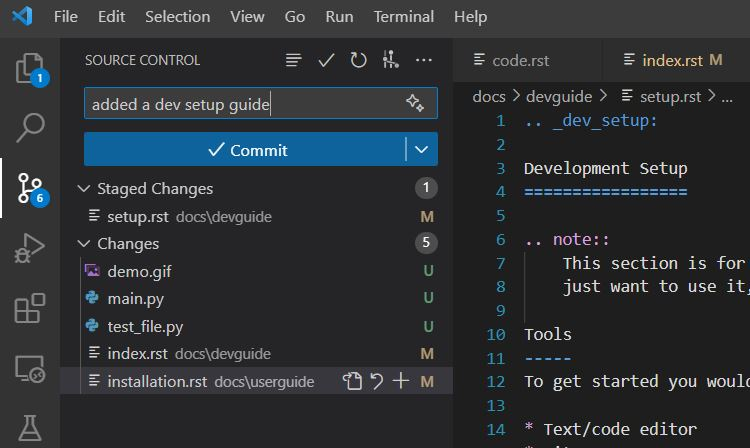

# Development Setup

!!! note

    This section is for you if you are intending to develop for COMPAS. If you
    just want to use it, please check out the [Installation](../userguide/installation.md) guide.

## Tools

To get started you would need to install the following tools:

- Text/code editor
- Git
- Python (virtual environment)

## Text/code editor

While any text editor can be used for developing COMPAS, we recommend using [Visual Studio Code](https://code.visualstudio.com/).
It is free to use, open source and has a lot of useful features for developing python code.

## Git

For version control we use [git](https://git-scm.com/). Our remote repository is hosted on [GitHub](https://github.com/compas-dev/compas/).

While git offers an extensive command line interface, there are plenty of GUI based clients out there including:

- [GitHub Desktop](https://desktop.github.com/)
- [SourceTree](https://www.sourcetreeapp.com/)

VS Code also has a built-in git client.

## Python virtual environments

During development there might be a need to install different versions of different dependencies, some of them might conflict with ones used for other projects.
Moreover, using early development code can often lead to a corrupt python environment which can be hard to fix. For these reasons it is highly recommended to use virtual environments for development.

For developing COMPAS we recommend using [conda](https://conda.io/docs/).

## Installing COMPAS for development

See the [Development Workflow](workflow.md) for more details on how to install COMPAS for development and how to contribute to the project.
