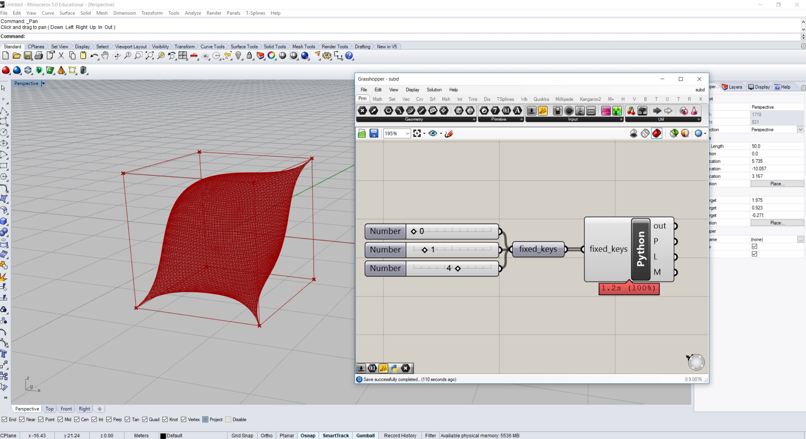

********************************************************************************
Mesh subdivision in GhPython using the Catmull-Clark algorithm
********************************************************************************

.. raw:: html

    

    

    
Downloads

* :download:`mesh-subd-modeling.ghx <mesh-subd-modeling.ghx>`

.. raw:: html

    

    

.. literalinclude:: mesh-subd-modeling.py
    :language: python
    :class: line-numbers
