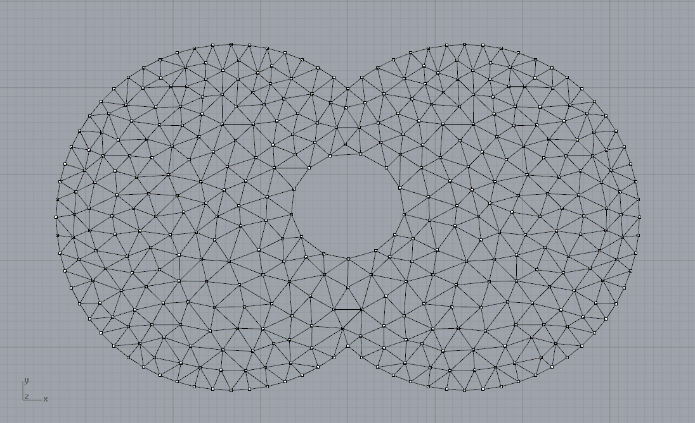

********************************************************************************
Delaunay triangulation with boundary
********************************************************************************

    A plain delaunay triangulation will always form a convex boundary and a continuous mesh without 'holes'.
    The following code shows how to include specific boundaries.

.. raw:: html

    

    

    
Downloads

* :download:`mesh-delaunay.3dm <mesh-delaunay.3dm>`

.. raw:: html

    

    

.. literalinclude:: mesh-delaunay-with-boundary.py
    :language: python

