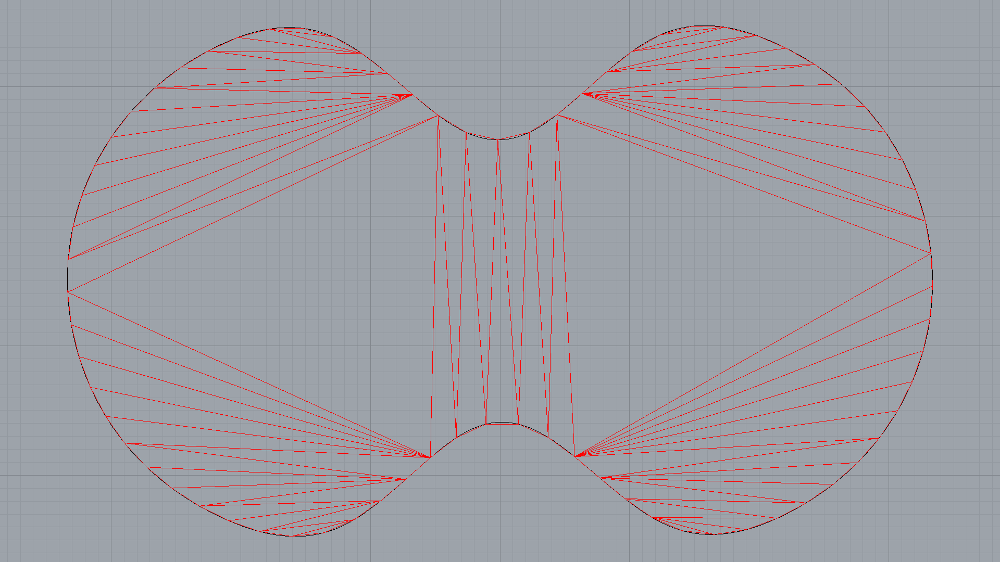

********************************************************************************
Remeshing 2D in Rhino
********************************************************************************

.. raw:: html

    

    

    
Downloads

* :download:`mesh-remeshing.3dm <mesh-remeshing.3dm>`

.. raw:: html

    

    

.. literalinclude:: mesh-remeshing.py
    :language: python
    :class: line-numbers
