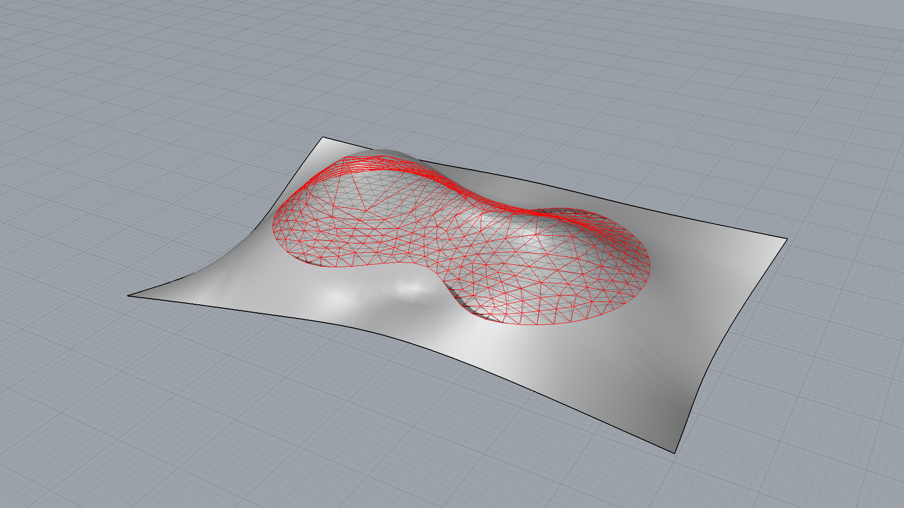

********************************************************************************
Mesh smoothing on a surface
********************************************************************************

.. raw:: html

    

    

    
Downloads

* :download:`mesh-smoothing-on-surface.3dm <mesh-smoothing-on-surface.3dm>`

.. raw:: html

    

    

.. literalinclude:: mesh-smoothing-on-surface.py
    :language: python

