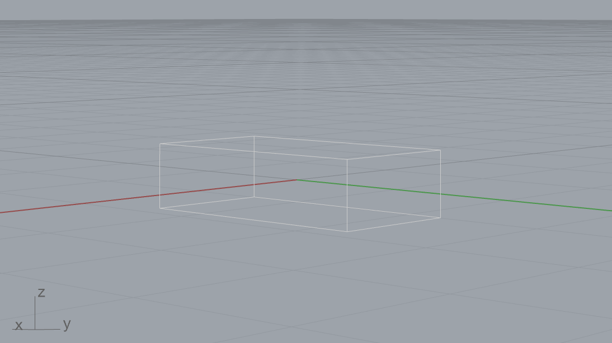

.. _robots:

******
Robots
******

.. highlight:: python

.. rst-class:: lead

COMPAS provides several fundamental structures and features that simplify working
with robots models, kinematic chains and coordinate frames. On top of this,
the `COMPAS FAB <https://gramaziokohler.github.io/compas_fab/latest/>`_ extension
package provides additional functionality to connect these models with planning
and execution tools and libraries.

Coordinate frames
=================

.. currentmodule:: compas.geometry

One of the most basic concepts related to robotics that COMPAS provides are
coordinate frames, which are described using the :class:`compas.geometry.Frame` class.

In any robotic setup, there exist multiple coordinate frames, and each one is defined
in relation to the next. Examples of typical coordinate frames are:

* World coordinate frame (``WCF``)
* Robot coordinate frame (``RCF``)
* Tool0 coordinate frame (``T0CF``)
* Tool coordinate frame (``TCF``)
* Object coordinate frame (``OCF``)

.. figure:: files/coordinate_frames.jpg
    :figclass: figure
    :class: figure-img img-fluid

    Coordinate frame convention of a robotic setup.

A coordinate frame is defined as a point and two orthonormal base vectors
(``xaxis``, ``yaxis``). Both the point and the vectors can be defined
using simple lists of XYZ components or using classes. Frames are
right-handed coordinate systems. The following two examples are equivalent:

::

    >>> from compas.geometry import Frame, Point, Vector

::

    >>> frame = Frame([0, 0, 0], [1, 0, 0], [0, 1, 0])
    >>> frame.point
    Point(0.000, 0.000, 0.000)

    >>> frame = Frame(Point(0, 0, 0), Vector(1, 0, 0), Vector(0, 1, 0))
    >>> frame.point
    Point(0.000, 0.000, 0.000)

There are shorthand constructors for the frames located at ``(0.0, 0.0, 0.0)``::

    >>> f1 = Frame.worldXY()
    >>> f2 = Frame.worldYZ()
    >>> f3 = Frame.worldZX()

And there are additional constructors to create coordinate frames
from alternative representations such as::

    >>> f4 = Frame.from_axis_angle_vector([0, 0, 0], point=[0, 0, 0])
    >>> f5 = Frame.from_points([0, 0, 0], [1, 0, 0], [0, 1, 0])
    >>> f6 = Frame.from_quaternion([1, 0, 0, 0], point=[0, 0, 0])

The relationship between coordinate frames is expressed as a
:class:`compas.geometry.Transformation` between the two, for example:

::

    >>> from compas.geometry import Transformation

::

    >>> f1 = Frame([15, 15, 15], [0, 1, 0], [0, 0, 1])
    >>> f2 = Frame.worldXY()
    >>> t = Transformation.from_frame_to_frame(f1, f2)
    Transformation([[0.0, 1.0, 0.0, -15.0], [0.0, 0.0, 1.0, -15.0], [1.0, 0.0, 0.0, -15.0], [0.0, 0.0, 0.0, 1.0]])

A very common need is to describe the position and rotation of a object
(eg. point, vector, mesh, etc.) in relation to its local coordinate frame,
and then transform it to the world coordinate frame, and vice versa.
These operations are simplified with the methods ``to_local_coordinates``
and ``to_world_coordinates`` of frames::

    >>> f1 = Frame([130, 25, 80], [1, 0, 0], [0, 1, 0])
    >>> local_point = Point(10, 10, 10)
    >>> f1.to_world_coordinates(local_point)
    Point(140.000, 35.000, 90.000)

Conversely, an object defined in world coordinate frame can be transformed to
a local coordinate frame using the ``to_local_coordinates`` method::

    >>> p = Point(10, 10, 10)
    >>> f1 = Frame([130, 25, 80], [1, 0, 0], [0, 1, 0])
    >>> f1.to_local_coordinates(p)
    Point(-120.000, -15.000, -70.000)

Robot models
============

Robotic arms, like those typically used in digital fabrication, are fundamentally
kinematic chains of rigid bodies, i.e. **links**, connected by **joints** to
provide constrained motion. Kinematics is a subdomain of mechanics, and contrary
to dynamics, it concerns the laws of motion without considering forces.

A robot model is a set of links and joints that form a tree structure where each
joint has a coordinate frame around which it rotates or translates, depending
on the joint type.

COMPAS supports robot models defined in a standard robot description format
called ``URDF``, which originates in the ROS community.

Links
-----

Links are the rigid bodies in a robot model. They can have zero or more
geometries associated. Associated geometry can serve visual or collision purposes.
Collision geometry is generally a simplified version of visual geometry to speed up
the collision checking process.

Joints
------

Joints are the connecting elements between links. There are four main types
of joints:

* **Revolute**: A hinge joint that rotates along the axis and has a limited
  range specified by the upper and lower limits.
* **Continuous**: A hinge joint that rotates along the axis and has no limits.
* **Prismatic**: A sliding joint that slides along the axis, and has a limited
  range specified by the upper and lower limits.
* **Fixed**: Not really a joint because it cannot move, all degrees of freedom
  are locked.

Visualizing Robots
==================

Before jumping into how to build a robot model, let's first see how to visualize
one. This can be done with Blender, Rhino or Grasshopper using one of COMPAS's
artists.  The basic procedure is the same in
any of the CAD software (aside from the import statement). Below you can find an example code for both Rhino and Blender. 

.. raw:: html

    

        

            <ul class="nav nav-tabs card-header-tabs">
                <li class="nav-item">
                    <a class="nav-link active" data-toggle="tab" href="#visualise_robot_rhino">Rhino</a>
                </li>
                <li class="nav-item">
                    <a class="nav-link" data-toggle="tab" href="#visualise_robot_blender">Blender</a>
                </li>
            </ul>
        

        

            

.. raw:: html

    

Be sure to first install COMPAS for Rhino.  While the following code is incomplete,
it can be used as a scaffolding for code to be run in a Python script editor within Rhino.

.. code-block:: python

    import compas
    from compas.robots import RobotModel
    from compas_rhino.artists import RobotModelArtist

    model = RobotModel('Robby')

    # Add some geometry to Robby here

    artist = RobotModelArtist(model, layer='COMPAS::Example Robot')
    artist.clear_layer()
    artist.draw_visual()

.. raw:: html

    

    

.. code-block:: python

    import compas
    from compas.robots import GithubPackageMeshLoader
    from compas.robots import RobotModel
    import compas_blender
    from compas_blender.artists import RobotModelArtist, BaseArtist

    compas_blender.clear()  # Delete all objects in the scene

    compas.PRECISION = '12f'
    # Load the urdf-file from Github 
    github = GithubPackageMeshLoader('ros-industrial/abb', 'abb_irb6600_support', 'kinetic-devel')
    model = RobotModel.from_urdf_file(github.load_urdf('irb6640.urdf'))
    model.load_geometry(github)
    
    # Load the robot meshes into the blender scene
    artist = RobotModelArtist(model, collection='COMPAS FAB::Example')

Note that the blender ``RobotModelArtist`` is not as developed as the one for Rhino. 

.. raw:: html

    

.. raw:: html

    

    

    

See below for a complete example in Rhino.

Building robots models
======================

Robot models are represented by the :class:`compas.robots.RobotModel` class.
There are various ways to construct a robot model. The following snippet
shows how to construct one programmatically:

::

    >>> from compas.robots import Joint, Link, RobotModel

::

    >>> j1 = Joint('joint_1', 'revolute', parent='base', child='link_1')
    >>> j2 = Joint('joint_2', 'revolute', parent='link_1', child='link_2')
    >>> j3 = Joint('joint_3', 'revolute', parent='link_2', child='link_3')
    >>> j4 = Joint('joint_4', 'revolute', parent='link_3', child='link_4')
    >>> j5 = Joint('joint_5', 'revolute', parent='link_4', child='link_5')
    >>> j6 = Joint('joint_6', 'revolute', parent='link_5', child='link_6')
    >>> l0 = Link('base')
    >>> l1 = Link('link_1')
    >>> l2 = Link('link_2')
    >>> l3 = Link('link_3')
    >>> l4 = Link('link_4')
    >>> l5 = Link('link_5')
    >>> l6 = Link('link_6')
    >>> links = [l0, l1, l2, l3, l4, l5, l6]
    >>> joints = [j1, j2, j3, j4, j5, j6]
    >>> robot = RobotModel('johnny-5', joints=joints, links=links)
    >>> robot.get_configurable_joint_names()
    ['joint_1', 'joint_2', 'joint_3', 'joint_4', 'joint_5', 'joint_6']

This approach can end up being very verbose, so the methods ``add_link``
and ``add_joint`` of :class:`compas.robots.RobotModel` offer an alternative that
significantly reduces the amount of code required.  Starting with an empty
robot model, adding a link in the shape of a box is as easy as:

::

    >>> from compas.geometry import Box, Frame
    >>> from compas.robots import RobotModel

::

    >>> model = RobotModel(name='Boxy')
    >>> box = Box(Frame.worldXY(), 1, 2, .5)
    >>> model.add_link(name='box_link', visual_meshes=[box])

This code snippet can be modified and run in a Rhino python editor
to visualize Boxy.  Throughout the rest of this tutorial, the code
snippets will include the lines for visualization in Rhino, but be
aware that the class :class:`compas.robots.RobotModel` can be used,
and is useful, outside of a CAD environment.

.. code-block:: python

    from compas.geometry import Box, Frame
    from compas.robots import RobotModel
    from compas_rhino.artists import RobotModelArtist

    model = RobotModel(name='Boxy')
    box = Box(Frame.worldXY(), 1, 2, .5)
    model.add_link(name='box_link', visual_meshes=[box])

    artist = RobotModelArtist(model, layer='COMPAS::Example Robot')
    artist.clear_layer()
    artist.draw_visual()

As can be seen, this has added a box of dimensions ``1`` x ``2`` x ``.5``
whose geometric center and orientation coincides with the world XY frame.
The ``visual_meshes`` argument can be given a list containing COMPAS
primitives such as :class:`compas.geometry.Box` or the more complex
COMPAS meshes :class:`compas.geometry.Mesh`. For simplicity,
this tutorial uses only primitives.

To reposition the box relative to the link's
origin, simply change the frame of the provided box. To move the box so that it sits
above the XY plane, the origin must be shifted in the z-direction by half the height
of the box.  The box is also shifted slightly forward in the y-direction:

.. code-block:: python

    from compas.geometry import Box, Frame
    from compas.robots import RobotModel
    from compas_rhino.artists import RobotModelArtist

    model = RobotModel(name='Boxy')
    box = Box(Frame([0, .5, .25], [1, 0, 0], [0, 1, 0]), 1, 2, .5)
    model.add_link(name='box_link', visual_meshes=[box])

    artist = RobotModelArtist(model, layer='COMPAS::Example Robot')
    artist.clear_layer()
    artist.draw_visual()

.. figure:: files/boxy_2.png
    :figclass: figure
    :class: figure-img img-fluid

A link may have more than one geometric element associated to it.  Now
there is a stack of two boxes:

.. code-block:: python

    from compas.geometry import Box, Frame
    from compas.robots import RobotModel
    from compas_rhino.artists import RobotModelArtist

    model = RobotModel(name='Boxy')
    box_1 = Box(Frame([0, .5, .25], [1, 0, 0], [0, 1, 0]), 1, 2, .5)
    box_2 = Box(Frame([0, 0, 4], [1, 0, 0], [0, 1, 0]), .5, 1, 7)
    model.add_link(name='box_link', visual_meshes=[box_1, box_2])

    artist = RobotModelArtist(model, layer='COMPAS::Example Robot')
    artist.clear_layer()
    artist.draw_visual()

.. figure:: files/boxy_3.png
    :figclass: figure
    :class: figure-img img-fluid

Remember that the frame of the box is the geometric center of the box relative
to the link's origin (which, in this case, happens to be the world XY frame).
So to stack the boxes, the center of ``box_2`` must be placed at a height of
``<height of box_1> + 1/2 * <height of box_2> = .5 + .5 * 7 = 4``.

One link does not an interesting robot make.  The following code snippet adds
a cylindrical second link as well as a joint connecting the two.

.. code-block:: python

    from compas.geometry import Box, Circle, Cylinder, Frame, Plane, Vector
    from compas.robots import Joint, RobotModel
    from compas_rhino.artists import RobotModelArtist

    model = RobotModel(name='Jointy')
    box_1 = Box(Frame([2, .5, .25], [1, 0, 0], [0, 1, 0]), 1, 2, .5)
    box_2 = Box(Frame([2, 0, 4], [1, 0, 0], [0, 1, 0]), .5, 1, 7)
    box_link = model.add_link(name='box_link', visual_meshes=[box_1, box_2])

    cylinder = Cylinder(Circle(Plane([0, 0, 0], [0, 0, 1]), .5), 8)
    cylinder_link = model.add_link(name='cylinder_link', visual_meshes=[cylinder])

    origin = Frame([0, 0, 7], [1, 0, 0], [0, 1, 0])
    axis = Vector(1, 0, 0)
    model.add_joint(
         name='box_cylinder_joint',
         type=Joint.CONTINUOUS,
         parent_link=box_link,
         child_link=cylinder_link,
         origin=origin,
         axis=axis,
    )

    artist = RobotModelArtist(model, layer='COMPAS::Example Robot')
    artist.clear_layer()
    artist.draw_visual()

.. figure:: files/jointy.png
    :figclass: figure
    :class: figure-img img-fluid

There's a lot going on in this snippet, so let's break it down.  First, the link
containing the stacked boxes is added, but the geometry has been shifted to the
side ``2`` units in the x-direction.  Second, a cylindrical link is added.
The cylinder has height ``8`` and radius ``.5`` and is vertically oriented.  Finally, a
joint is added.  This is the most involved operation so far, so let's explore
this in detail.

Several parameters must be defined for the joint to be sensible.
The required parameters for a minimally defined joint are the ``name``, ``type``,
``parent_link`` and ``child_link``.  The location and orientation of the joint is defined
by the ``origin``, which specifies a frame relative to the origin of the ``parent_link``.
In this case, the location of the joint is located ``7`` units above (ie,
in the z-direction) the origin of the ``box_link``, making it ``.5`` units below the top
of the second box.  The origin of the joint also specifies the origin of its
``child_link``.  Here, this means that the center of the cylinder will coincide with
the location of the joint.  Since the geometries of the boxes have been shifted,
the boxes and the cylinder do not overlap.  If the joint origin is not specified,
it will default to coincide with the origin of the ``parent_link``.  Since a continuous
joint was added, it makes sense that the axis of rotation would also need to be given.
Here, the joint will rotate about the joint origin's x-axis.

Adding a bit more geometry and a few links with fixed joints and we arrive at a rough
model of the classic drinking bird toy (full code
:download:`here <files/drinking_bird.py>`).

.. figure:: files/drinking_bird.png
    :figclass: figure
    :class: figure-img img-fluid

While it can be useful to programmatically create a robot, more often than not, robot
models are loaded from URDF files. To load a URDF into a robot model, use the
``from_urdf_file`` method::

    >>> model = RobotModel.from_urdf_file('ur5.urdf')
    >>> print(model)

Since a large number of robot models defined in URDF are available on Github,
there are specialized loaders that allow loading an entire model including
its linked geometry directly from a Github repository:

::

    >>> import compas
    >>> from compas.robots import GithubPackageMeshLoader
    >>> from compas.robots import RobotModel

::

    >>> # Set high precision to import meshes defined in meters
    >>> compas.PRECISION = '12f'
    >>> github = GithubPackageMeshLoader('ros-industrial/abb', 'abb_irb6600_support', 'kinetic-devel')
    >>> model = RobotModel.from_urdf_file(github.load_urdf('irb6640.urdf'))
    >>> model.load_geometry(github)
    >>> print(model)
    Robot name=abb_irb6640, Links=11, Joints=10 (6 configurable)

Another common scenario is to load robot models from a running ROS system.
`ROS (Robot Operating System) <https://www.ros.org/>`_ is a very complex and
mature tool, and its setup is beyond the scope of this tutorial, but
an overview of some of the installation options is available
`here <https://gramaziokohler.github.io/compas_fab/latest/backends/ros.html>`_.
Once ROS is configured on your system, the most convenient way to load the
robot model is to use **COMPAS FAB** and its ROS integration.
The following snippet shows how to load the robot model currently active in ROS:

::

    >>> from compas_fab.backends import RosClient

::

    >>> with RosClient() as ros:
    ...    robot = ros.load_robot(load_geometry=True)
    ...    print(robot.model)

FK, IK & Path Planning
======================

Robot models are the base for a large number of additional features that are
provided via extension packages. In particular, features such as
forward and inverse kinematic solvers and path planning are built on top of
these robot models, but are integrated into
`COMPAS FAB <https://gramaziokohler.github.io/compas_fab/latest/>`_.

For further details about these features, check the detailed examples in
COMPAS FAB documentation.
